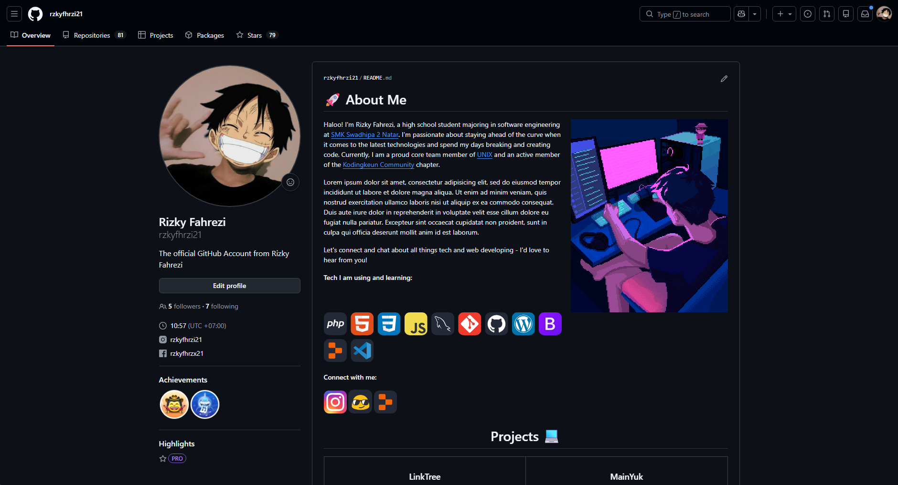
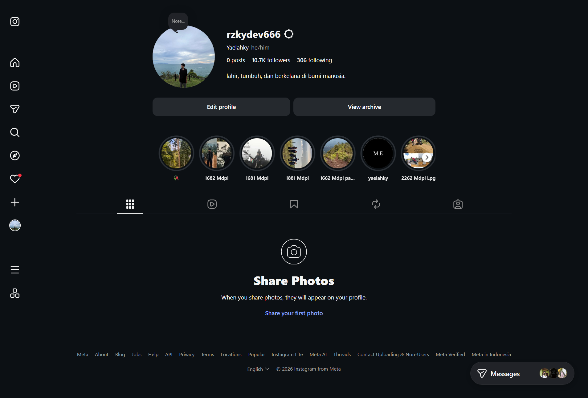

<div align="center">

# 🤖 AI Agent Harness Workspace

**"Operating System" pribadi untuk AI Agent dalam pengembangan produk nyata.**<br>
*Template workspace yang berisi kumpulan skill modular, aturan kerja AI, konfigurasi terminal, dan ratusan panduan teknis siap pakai.*

<br>

<p align="center">
  <a href="https://github.com/rzkydev666" target="_blank">
    
  </a>
  <br><br>
  <a href="https://instagram.com/rzkydev666" target="_blank">
    
  </a>
</p>

<br>
<br>

[](#)
[](#)
[](LICENSE)

</div>

---

Dibuat berdasarkan pengalaman langsung mengeksploitasi berbagai AI agent (Antigravity, Claude Code, Cursor, Codex) di lingkungan produksi. Workspace ini bukan sekadar direktori biasa, melainkan otak operasional yang mengatur **bagaimana AI harus berpikir, bekerja, dan mengambil keputusan** bersama saya.

---

## 🚀 Cara Penggunaan — Copy ke Project Baru atau Lama

Untuk setiap **project baru maupun project lama**, cukup salin 3 komponen berikut ke dalam root direktori project Anda:

```
project-anda/
├── AGENTS.md          ← Salin file ini (aturan induk AI)
├── .rtk/              ← Salin folder ini (konfigurasi RTK)
├── Zzz/               ← Salin folder ini (tempat script sementara)
└── @agents/           ← Salin folder ini (seluruh koleksi skill)
    └── AI-SKILLS/
        ├── PERSONA_SKILLS/
        ├── TOOL_SKILLS/
        ├── WORKFLOW_SKILLS/
        ├── SUPERPOWERS/
        ├── AGENT_SKILLS/
        ├── TASTE_SKILLS/
        ├── ECC_SKILLS/
        └── IMPECCABLE_SKILLS/
```

> **Catatan:** File `AGENTS.md` adalah pengganti dari `AI_RULES.md` yang lama. Gunakan `AGENTS.md` sebagai satu-satunya file aturan induk AI.

### Langkah Inisialisasi Setelah Copy

1. **RTK** — Jalankan `./@agents/RTK/rtk.exe init` untuk generate konfigurasi filter terminal
2. **Context7** — Jalankan `npx ctx7 setup` untuk autentikasi dokumentasi otomatis
3. **Codebase Memory MCP** — Lakukan indexing project agar AI memahami struktur kode
4. **Baca `AGENTS.md`** — AI akan otomatis memahami semua aturan dan skill yang tersedia

---

## 📁 Struktur Direktori

| Direktori/File | Fungsi |
|---|---|
| `AGENTS.md` | File aturan induk AI — dibaca pertama kali oleh AI di setiap sesi |
| `.rtk/` | Konfigurasi Repository Toolkit untuk optimasi perintah terminal |
| `Zzz/` | Folder khusus untuk script sementara, scratch file, dan uji coba |
| `@agents/AI-SKILLS/` | Koleksi seluruh skill modular yang digunakan AI |
| `docs/` | Dokumen panduan project (BRIEF, CANVAS, PRD, dll) |

---

## 🎭 PERSONA_SKILLS — Gaya Komunikasi AI

Kumpulan persona yang mengubah cara AI berkomunikasi dan berpikir saat bekerja.

| Skill | Deskripsi |
|---|---|
| `CAVEMAN_SKILL.md` | Mode komunikasi sangat singkat dan padat — setiap respons dihemat semaksimal mungkin, cocok untuk sesi panjang yang butuh efisiensi token tinggi |
| `PONYTAIL_SKILL.md` | Mode *"Senior Dev Malas"* — AI memprioritaskan solusi paling simpel dan bersih, menolak over-engineering, selalu tanya *"apakah ini benar-benar perlu?"* (prinsip YAGNI) |
| `KOMENTAR_ORANG_TUA.md` | *(Pengecualian — jangan aktifkan kecuali diminta eksplisit)* Mode komentar kode bergaya orang tua yang panjang dan penjelasannya sangat detail |

---

## 🛠️ TOOL_SKILLS — Panduan Integrasi Tools & MCP

Panduan penggunaan tools dan MCP server yang terintegrasi dengan workflow AI.

| Skill | Deskripsi |
|---|---|
| `CODEBASE_MEMORY.md` | Panduan penggunaan Codebase Memory MCP — wajib dijalankan di awal agar AI memahami struktur repository secara menyeluruh sebelum mulai bekerja |
| `CONTEXT7.md` | Panduan penggunaan Context7 untuk mengambil dokumentasi resmi teknologi (React, Laravel, Next.js, dll) secara real-time tanpa mengandalkan data training lama |
| `FIRECRAWL.md` | Panduan web scraping dan pencarian dokumentasi dari sumber luar menggunakan Firecrawl MCP — digunakan ketika Context7 tidak mencukupi |
| `RTK_SKILL.md` | Panduan inisialisasi Repository Toolkit (RTK) untuk optimasi output terminal dan filtering perintah yang efisien |

---

## ⚙️ WORKFLOW_SKILLS — Standar Operasional & Alur Kerja

Aturan prosedur standar untuk setup lingkungan kerja, alur development, dan deployment.

| Skill | Deskripsi |
|---|---|
| `AGENTS-GENERAL.md` | Aturan umum perilaku AI agent — cara membaca brief, cara memulai sesi, cara menangani instruksi ambigu |
| `WORKFLOW_MODE.md` | Panduan mode-mode alur kerja AI yang berbeda tergantung jenis task (research, coding, debugging, planning) |
| `AI_SETUP_MACHINE.md` | Panduan setup environment mesin untuk AI — tools yang perlu diinstall, variabel lingkungan, dan konfigurasi awal |
| `CICD_SSH_SKILL.md` | Prosedur wajib untuk setup otomatis CI/CD menggunakan SSH Rsync dan Github Actions — langkah demi langkah dari zero hingga pipeline berjalan |

---

## ⚡ SUPERPOWERS — Skill Makro Lengkap

| Skill | Deskripsi |
|---|---|
| `SUPERPOWERS_SKILLS.md` | Koleksi skill modular raksasa untuk berbagai alur kerja — brainstorming, penulisan implementation plan, debugging sistematis, code review, dan banyak lagi. File tunggal dengan ratusan instruksi terstruktur |

---

## 🛠️ AGENT_SKILLS — Engineering Lifecycle

*(Dari repo [addyosmani/agent-skills](https://github.com/addyosmani/agent-skills))*

Kumpulan skill standar industri untuk menjaga kualitas software engineering selama siklus pengembangan oleh AI.

| Skill | Deskripsi |
|---|---|
| `api-and-interface-design.md` | Guides stable API and interface design |
| `browser-testing-with-devtools.md` | Tests in real browsers via Chrome DevTools MCP |
| `ci-cd-and-automation.md` | Automates CI/CD pipeline setup |
| `code-review-and-quality.md` | Conducts multi-axis code review |
| `code-simplification.md` | Simplifies code for clarity |
| `context-engineering.md` | Optimizes agent context setup |
| `debugging-and-error-recovery.md` | Guides systematic root-cause debugging |
| `deprecation-and-migration.md` | Manages deprecation and migration |
| `documentation-and-adrs.md` | Records decisions and documentation |
| `doubt-driven-development.md` | Subjects every non-trivial decision to adversarial review |
| `frontend-ui-engineering.md` | Builds production-quality, accessible, responsive user-facing UIs |
| `git-workflow-and-versioning.md` | Structures git workflow practices |
| `idea-refine.md` | Refines raw ideas into sharp, actionable concepts |
| `incremental-implementation.md` | Delivers changes incrementally |
| `interview-me.md` | Extracts what the user actually wants via interview |
| `observability-and-instrumentation.md` | Instruments code so production behavior is visible |
| `performance-optimization.md` | Optimizes application performance across all layers |
| `planning-and-task-breakdown.md` | Breaks work into ordered tasks |
| `security-and-hardening.md` | Hardens code against vulnerabilities |
| `shipping-and-launch.md` | Prepares production launches |
| `source-driven-development.md` | Grounds every implementation decision in official documentation |
| `spec-driven-development.md` | Creates specs before coding |
| `test-driven-development.md` | Drives development with tests |
| `using-agent-skills.md` | Discovers and invokes agent skills |

---

## 🎨 TASTE_SKILLS — Desain UI Premium Anti-Slop

*(Dari repo [Leonxlnx/taste-skill](https://github.com/Leonxlnx/taste-skill))*

Kumpulan skill untuk merancang antarmuka yang terlihat premium, modern, dan tidak generik. Setiap skill memiliki fokus visual yang berbeda.

| Skill | Deskripsi |
|---|---|
| `taste-skill.md` | Anti-slop frontend skill utama — AI membaca brief, menyimpulkan arah desain yang tepat, dan menghasilkan UI yang tidak terlihat seperti template. Versi v2 eksperimental dengan audit-first pada redesign |
| `taste-skill-v1.md` | Versi v1 original dari taste-skill — dipertahankan untuk project yang bergantung pada perilaku eksak v1 |
| `soft-skill.md` | Mengajarkan AI cara mendesain seperti agensi high-end — font spesifik, spacing, shadow, struktur kartu, dan animasi yang membuat website terasa mahal dan tidak generik |
| `minimalist-skill.md` | Antarmuka editorial yang bersih — palet monokrom hangat, kontras tipografi, grid bento datar, pastel muted. Tanpa gradien, tanpa shadow berat. Cocok untuk gaya Notion/Linear |
| `brutalist-skill.md` | Antarmuka mekanis yang keras — tipografi Swiss, kontras tajam, layout eksperimental, estetika terminal militer. Untuk dashboard data-heavy atau portofolio yang ingin terasa seperti blueprint |
| `gpt-tasteskill.md` | Varian lebih ketat untuk GPT/Codex — variance layout tinggi, arah GSAP lebih kuat, anti-slop yang agresif, struktur halaman AIDA, tipografi editorial lebar |
| `image-to-code-skill.md` | Pipeline image-first — AI menghasilkan gambar desain, menganalisisnya secara mendalam, lalu mengimplementasikan website yang semirip mungkin dengan gambar tersebut |
| `redesign-skill.md` | Meningkatkan website dan app yang sudah ada ke kualitas premium — audit desain saat ini, identifikasi pola AI generik, dan terapkan standar high-end tanpa merusak fungsionalitas |
| `output-skill.md` | Override perilaku truncation LLM — memaksa output kode yang lengkap, melarang placeholder comment, dan menangani split karena batas token secara bersih |
| `stitch-skill.md` | Sistem desain semantik untuk Google Stitch — menghasilkan file DESIGN.md yang ramah agent dengan standar tipografi, warna, layout asimetris, dan micro-motion |
| `brandkit.md` | Skill generasi gambar brand-kit premium — logo system, panduan identitas, palet warna, tipografi, dan mockup aplikasi. Dioptimalkan untuk brand minimalis, cinematic, dark-tech, dan luxury |
| `imagegen-frontend-web.md` | Skill generasi gambar referensi desain website — menghasilkan SATU gambar horizontal terpisah per section landing page untuk referensi implementasi developer |
| `imagegen-frontend-mobile.md` | Skill generasi gambar konsep aplikasi mobile premium — layar iOS/Android/cross-platform dengan hierarki bersih, teks mudah dibaca, dan framing mockup iPhone yang konsisten |

---

## 🧠 ECC_SKILLS — Agent Harness Operating System

*(Dari repo [affaan-m/ecc](https://github.com/affaan-m/ecc))*

Kumpulan masif 278 skill modular yang mencakup seluruh spektrum pengembangan software modern. Bertindak sebagai *operating system* untuk agent — dari frontend hingga DevOps, dari keamanan hingga penelitian ilmiah. Pilih dan aktifkan hanya skill yang relevan dengan stack teknologi project Anda.

### 🤖 Agent & AI Engineering

| Skill | Deskripsi |
|---|---|
| `accessibility.md` | Desain, implementasi, dan audit produk digital inklusif menggunakan WCAG 2.2 Level AA |
| `agent-architecture-audit.md` | Diagnostik full-stack untuk aplikasi agent dan LLM — audit 12-layer agent stack untuk wrapper regression, memory pollution, dan tool discipline failures |
| `agent-eval.md` | Perbandingan head-to-head coding agents (Claude Code, Aider, Codex) pada task custom dengan metrik pass rate, biaya, waktu, dan konsistensi |
| `agent-harness-construction.md` | Desain dan optimasi action space agent AI, definisi tool, dan formatting observasi untuk completion rate yang lebih tinggi |
| `agent-introspection-debugging.md` | Workflow self-debugging terstruktur untuk kegagalan AI agent menggunakan capture, diagnosis, contained recovery, dan introspection report |
| `agent-payment-x402.md` | Tambahkan eksekusi pembayaran x402 ke AI agent dengan per-task budget, spending control, dan non-custodial wallet |
| `agent-self-evaluation.md` | Digunakan setelah menyelesaikan task kompleks — agent menilai sendiri outputnya pada 5 sumbu dengan scorecard 1-5 dan saran perbaikan konkret |
| `agent-sort.md` | Bangun rencana install ECC yang didukung bukti untuk repo spesifik dengan menyortir skill ke bucket DAILY vs LIBRARY |
| `agentic-engineering.md` | Beroperasi sebagai agentic engineer menggunakan eval-first execution, dekomposisi, dan model routing berbasis biaya |
| `agentic-os.md` | Bangun multi-agent operating system persisten di Claude Code — kernel architecture, specialist agents, slash commands, file-based memory, dan otomasi terjadwal |
| `ai-first-engineering.md` | Model operasi engineering untuk tim di mana AI agent menghasilkan sebagian besar output implementasi |
| `ai-regression-testing.md` | Strategi regression testing untuk pengembangan berbantuan AI — API testing sandbox-mode tanpa ketergantungan database, workflow bug-check otomatis |
| `autonomous-agent-harness.md` | Ubah Claude Code menjadi sistem agent otonom penuh dengan persistent memory, operasi terjadwal, computer use, dan task queuing |
| `autonomous-loops.md` | Pola dan arsitektur untuk autonomous Claude Code loops — dari pipeline sequential sederhana hingga sistem multi-agent DAG berbasis RFC |
| `continuous-agent-loop.md` | Pola untuk continuous autonomous agent loops dengan quality gates, eval, dan recovery control |
| `continuous-learning-v2.md` | Sistem pembelajaran berbasis instinct — mengamati sesi via hooks, membuat instinct atomik dengan confidence scoring, dan mengembangkannya menjadi skill/command/agent |
| `continuous-learning.md` | *[DEPRECATED — gunakan continuous-learning-v2]* Legacy v1 stop-hook skill extractor |
| `council.md` | Kumpulkan four-voice council untuk keputusan ambigu, tradeoff, dan go/no-go calls — structured disagreement sebelum memilih |
| `dynamic-workflow-mode.md` | Desain task-local harness, eval gates, dan reusable skill extraction untuk Claude dynamic workflow mode |
| `eval-harness.md` | Framework evaluasi formal untuk Claude Code sessions mengimplementasikan prinsip eval-driven development (EDD) |
| `gan-style-harness.md` | GAN-inspired Generator-Evaluator agent harness untuk membangun aplikasi berkualitas tinggi secara otonom berdasarkan paper desain Anthropic Maret 2026 |
| `gateguard.md` | Fact-forcing gate yang memblokir Edit/Write/Bash dan meminta investigasi konkret sebelum mengizinkan tindakan — meningkatkan kualitas output secara terukur |
| `loop-design-check.md` | Desain goal-oriented agent loop dan review untuk cara loop bisa gagal — spinning, Goodhart-gaming verifier, atau menjalankan jawaban salah hingga selesai |
| `parallel-execution-optimizer.md` | Digunakan ketika task ingin diselesaikan jauh lebih cepat melalui parallel work, concurrent agents, batched tool calls, atau isolated worktrees |
| `plan-orchestrate.md` | Baca dokumen plan, dekomposisi ke langkah-langkah, desain per-step agent chain dari katalog ECC, dan emit /orchestrate prompts siap pakai |
| `ralphinho-rfc-pipeline.md` | Pola eksekusi multi-agent DAG berbasis RFC dengan quality gates, merge queues, dan work unit orchestration |
| `santa-method.md` | Verifikasi adversarial multi-agent dengan convergence loop — dua review agent independen harus sama-sama lolos sebelum output dikirim |
| `search-first.md` | Workflow research-before-coding — cari tools, library, dan pola yang sudah ada sebelum menulis kode custom |
| `strategic-compact.md` | Menyarankan manual context compaction pada interval logis untuk mempertahankan konteks melalui fase task |
| `team-agent-orchestration.md` | Jalankan team-based orchestration untuk agent squads menggunakan work items, ownership, agent Kanban, merge gates, dan control pane handoffs |
| `team-builder.md` | Interactive agent picker untuk menyusun dan mengirim tim paralel |
| `token-budget-advisor.md` | Advisor untuk pengelolaan token budget dalam sesi Claude |
| `verification-loop.md` | Sistem verifikasi komprehensif untuk Claude Code sessions |

### 🌐 Frontend & UI

| Skill | Deskripsi |
|---|---|
| `frontend-patterns.md` | Pola development frontend untuk React, Next.js, state management, performance optimization, dan UI best practices |
| `frontend-design-direction.md` | Tetapkan arah desain frontend spesifik ECC untuk pekerjaan UI produksi — website, dashboard, aplikasi, komponen, landing page |
| `frontend-a11y.md` | Aksesibilitas frontend — implementasi ARIA, keyboard navigation, screen reader support, dan color contrast |
| `frontend-slides.md` | Buat presentasi HTML yang kaya animasi dari nol atau dengan mengkonversi file PowerPoint |
| `react-patterns.md` | Pola React 18/19 termasuk hooks discipline, server/client component boundaries, Suspense + error boundaries, form actions, dan data fetching |
| `react-performance.md` | Optimasi performa React dan Next.js — 70+ aturan lintas 8 kategori prioritas: waterfall, bundle size, server-side, client fetching, re-render |
| `react-testing.md` | Testing komponen React dengan React Testing Library, Vitest/Jest, MSW untuk network mocking, dan accessibility assertions dengan axe |
| `react-native-patterns.md` | Pola app React Native dan Expo — Expo Router, state separation, TanStack Query, Zod, NativeWind, native APIs, dan secure storage |
| `nextjs-turbopack.md` | Next.js 16+ dan Turbopack — incremental bundling, FS caching, dev speed, dan kapan memilih Turbopack vs webpack |
| `angular-developer.md` | Generate kode Angular dan panduan arsitektural — reactivity, signals, forms, DI, routing, SSR, aksesibilitas, animations, Tailwind CSS |
| `vue-patterns.md` | Pola Vue.js 3 Composition API, arsitektur komponen, reaktivitas, Pinia state management, Vue Router, dan Nuxt SSR |
| `nuxt4-patterns.md` | Pola Nuxt 4 untuk hydration safety, performance, route rules, lazy loading, dan SSR-safe data fetching |
| `vite-patterns.md` | Pola Vite build tool — config, plugins, HMR, env variables, proxy setup, SSR, library mode, dan build optimization |
| `design-system.md` | Gunakan untuk generate atau audit design systems, cek visual consistency, dan review PR yang menyentuh styling |
| `make-interfaces-feel-better.md` | Terapkan detail design-engineering konkret yang membuat antarmuka terasa polished — spacing, tipografi, borders, shadows, motion, hit areas |
| `motion-foundations.md` | Motion tokens, spring presets, performance rules, device adaptation, aksesibilitas, dan SSR safety untuk React/Next.js — layer foundation untuk semua motion skill |
| `motion-patterns.md` | Pola animasi siap produksi untuk React/Next.js — button, modal, toast, stagger, page transitions, exit animations, scroll, dan layout |
| `motion-advanced.md` | Pola motion lanjutan — drag & drop, gestures, text animations, SVG path drawing, custom hooks, imperative sequences, dan loaders |
| `motion-ui.md` | Sistem UI motion siap produksi untuk React/Next.js |
| `ui-demo.md` | Rekam video demo UI yang rapi menggunakan Playwright — walkthrough, screen recording, atau tutorial video web app |
| `ui-to-vue.md` | Konversi batch screenshot UI atau design export menjadi komponen Vue 3 dengan Vant, Element Plus, atau Ant Design Vue |
| `seo.md` | Audit, rencana, dan implementasi perbaikan SEO — technical SEO, on-page optimization, structured data, Core Web Vitals, dan strategi konten |
| `browser-qa.md` | Otomasi visual testing dan verifikasi interaksi UI menggunakan browser automation setelah deploy fitur |
| `windows-desktop-e2e.md` | E2E testing untuk aplikasi desktop Windows native (WPF, WinForms, Win32) menggunakan pywinauto dan Windows UI Automation |
| `e2e-testing.md` | Pola Playwright E2E testing, Page Object Model, konfigurasi, integrasi CI/CD, artifact management, dan strategi flaky test |

### ⚙️ Backend & API

| Skill | Deskripsi |
|---|---|
| `backend-patterns.md` | Pola arsitektur backend, API design, optimasi database, dan best practices server-side untuk Node.js, Express, dan Next.js API routes |
| `api-design.md` | Pola desain REST API — resource naming, status codes, pagination, filtering, error responses, versioning, dan rate limiting untuk production API |
| `api-connector-builder.md` | Bangun API connector atau provider baru dengan mencocokkan pola integrasi repo target yang sudah ada |
| `error-handling.md` | Pola error handling yang robust untuk TypeScript, Python, dan Go — typed errors, error boundaries, retries, circuit breakers, dan user-facing error messages |
| `mcp-server-patterns.md` | Bangun MCP server dengan Node/TypeScript SDK — tools, resources, prompts, Zod validation, stdio vs Streamable HTTP |
| `hexagonal-architecture.md` | Desain, implementasi, dan refaktor sistem Ports & Adapters dengan domain boundaries yang jelas dan dependency inversion |

### 🗄️ Database

| Skill | Deskripsi |
|---|---|
| `postgres-patterns.md` | Pola database PostgreSQL untuk query optimization, schema design, indexing, dan security — berdasarkan best practices Supabase |
| `mysql-patterns.md` | Pola MySQL dan MariaDB untuk schema, query, indexing, transaction, replikasi, dan connection-pool untuk backend produksi |
| `redis-patterns.md` | Pola Redis data structure, strategi caching, distributed locks, rate limiting, pub/sub, dan connection management |
| `database-migrations.md` | Best practices migrasi database untuk schema changes, data migrations, rollbacks, dan zero-downtime deployments |
| `clickhouse-io.md` | Pola database ClickHouse, query optimization, analytics, dan data engineering untuk analytical workloads berkinerja tinggi |
| `prisma-patterns.md` | Pola Prisma ORM untuk TypeScript backend — schema design, query optimization, transactions, pagination, dan jebakan kritis seperti updateMany |
| `content-hash-cache-pattern.md` | Cache hasil pemrosesan file mahal menggunakan SHA-256 content hashes — path-independent, auto-invalidating, dengan service layer separation |

### 🐍 Python & Django

| Skill | Deskripsi |
|---|---|
| `python-patterns.md` | Idiom Pythonic, standar PEP 8, type hints, dan best practices untuk membangun aplikasi Python yang robust dan maintainable |
| `python-testing.md` | Strategi testing Python menggunakan pytest, TDD methodology, fixtures, mocking, parametrization, dan coverage |
| `pytorch-patterns.md` | Pola PyTorch deep learning dan best practices untuk training pipelines, arsitektur model, dan data loading yang reproduktibel |
| `django-patterns.md` | Pola arsitektur Django, REST API design dengan DRF, ORM best practices, caching, signals, middleware, dan Django production-grade |
| `django-celery.md` | Pola async task Django + Celery — konfigurasi, task design, beat scheduling, retries, canvas workflows, monitoring, dan testing |
| `django-security.md` | Django security best practices — authentication, authorization, CSRF, SQL injection, XSS, dan konfigurasi deployment yang aman |
| `django-tdd.md` | Strategi testing Django dengan pytest-django, TDD methodology, factory_boy, mocking, coverage, dan testing Django REST Framework APIs |
| `django-verification.md` | Verification loop untuk project Django — migrations, linting, tests, security scans, dan deployment readiness checks |
| `fastapi-patterns.md` | FastAPI best practices — project structure, Pydantic v2 schemas, dependency injection, async handlers, authentication, dan testing |
| `generating-python-installer.md` | Paket installer Python komersial untuk Windows — Nuitka extreme compilation, dist slimming, dan Inno Setup packaging untuk installer terkecil dan tercepat |

### ☕ Java / Kotlin / JVM

| Skill | Deskripsi |
|---|---|
| `java-coding-standards.md` | Standar coding Java untuk Spring Boot dan Quarkus — naming, immutability, Optional, streams, exceptions, generics, CDI, dan reactive patterns |
| `kotlin-patterns.md` | Pola Kotlin idiomatik, best practices, dan konvensi untuk aplikasi yang robust dengan coroutines, null safety, dan DSL builders |
| `kotlin-coroutines-flows.md` | Pola Kotlin Coroutines dan Flow untuk Android dan KMP — structured concurrency, Flow operators, StateFlow, error handling, dan testing |
| `kotlin-exposed-patterns.md` | Pola JetBrains Exposed ORM — DSL queries, DAO pattern, transactions, HikariCP connection pooling, Flyway migrations |
| `kotlin-ktor-patterns.md` | Pola Ktor server — routing DSL, plugins, authentication, Koin DI, kotlinx.serialization, WebSockets, dan testApplication testing |
| `kotlin-testing.md` | Pola testing Kotlin dengan Kotest, MockK, coroutine testing, property-based testing, dan Kover coverage |
| `jpa-patterns.md` | Pola JPA/Hibernate untuk entity design, relationships, query optimization, transactions, auditing, indexing, dan pagination |
| `springboot-patterns.md` | Pola arsitektur Spring Boot, REST API design, layered services, data access, caching, async processing, dan logging |
| `springboot-security.md` | Spring Security best practices — authn/authz, validasi, CSRF, secrets, headers, rate limiting, dan keamanan dependensi |
| `springboot-tdd.md` | TDD untuk Spring Boot menggunakan JUnit 5, Mockito, MockMvc, Testcontainers, dan JaCoCo |
| `springboot-verification.md` | Verification loop untuk Spring Boot — build, static analysis, tests, security scans, dan diff review sebelum release |
| `quarkus-patterns.md` | Pola arsitektur Quarkus 3.x LTS dengan Camel untuk messaging, RESTful API, CDI, Panache, dan async processing |
| `quarkus-security.md` | Quarkus Security best practices — authentication, authorization, JWT/OIDC, RBAC, input validation, dan secrets management |
| `quarkus-tdd.md` | TDD untuk Quarkus 3.x menggunakan JUnit 5, Mockito, REST Assured, Camel testing, dan JaCoCo |
| `quarkus-verification.md` | Verification loop untuk Quarkus — build, static analysis, tests, native compilation, dan diff review sebelum release |
| `android-clean-architecture.md` | Pola Clean Architecture untuk Android dan Kotlin Multiplatform — module structure, dependency rules, UseCases, Repositories |
| `compose-multiplatform-patterns.md` | Pola Compose Multiplatform dan Jetpack Compose — state management, navigation, theming, performance, dan platform-specific UI |
| `kotlin-coroutines-flows.md` | Pola Kotlin Coroutines dan Flow untuk Android dan KMP |
| `tinystruct-patterns.md` | Panduan ahli untuk pengembangan dengan framework Java tinystruct — Application classes, @Action-mapped routes, ActionRegistry, HTTP/CLI dual-mode |

### 🦀 Go, Rust, C++, C#, .NET

| Skill | Deskripsi |
|---|---|
| `golang-patterns.md` | Pola Go idiomatik, best practices, dan konvensi untuk membangun aplikasi Go yang robust dan efisien |
| `golang-testing.md` | Pola testing Go — table-driven tests, subtests, benchmarks, fuzzing, dan test coverage dengan pendekatan TDD |
| `rust-patterns.md` | Pola Rust idiomatik — ownership, error handling, traits, concurrency, dan best practices untuk aplikasi aman dan performan |
| `rust-testing.md` | Pola testing Rust — unit tests, integration tests, async testing, property-based testing, mocking, dan coverage |
| `cpp-coding-standards.md` | Standar coding C++ berdasarkan C++ Core Guidelines — modern, safe, dan idiomatic practices |
| `cpp-testing.md` | Testing C++ dengan GoogleTest/CTest, coverage, dan sanitizers |
| `dotnet-patterns.md` | Pola C# dan .NET idiomatik — dependency injection, async/await, dan best practices untuk .NET yang maintainable |
| `csharp-testing.md` | Pola testing C# dan .NET dengan xUnit, FluentAssertions, mocking, integration tests |
| `fsharp-testing.md` | Pola testing F# dengan xUnit, FsUnit, Unquote, FsCheck property-based testing |

### 📱 iOS & Swift

| Skill | Deskripsi |
|---|---|
| `swiftui-patterns.md` | Pola arsitektur SwiftUI, state management dengan @Observable, view composition, navigation, performance, dan modern iOS/macOS UI |
| `swift-concurrency-6-2.md` | Swift 6.2 Approachable Concurrency — single-threaded by default, @concurrent untuk explicit background offloading |
| `swift-actor-persistence.md` | Thread-safe data persistence di Swift menggunakan actors — in-memory cache dengan file-backed storage, eliminating data races by design |
| `swift-protocol-di-testing.md` | Protocol-based dependency injection untuk kode Swift yang testable — mock file system, network, dan external APIs |
| `foundation-models-on-device.md` | Apple FoundationModels framework untuk on-device LLM — text generation, guided generation, tool calling, dan snapshot streaming di iOS 26+ |
| `liquid-glass-design.md` | iOS 26 Liquid Glass design system — dynamic glass material dengan blur, reflection, dan interactive morphing untuk SwiftUI, UIKit, dan WidgetKit |
| `ios-icon-gen.md` | Generate iOS app icons sebagai PNG imageset untuk Xcode asset catalog dari SF Symbols atau Iconify API |
| `dart-flutter-patterns.md` | Pola Dart dan Flutter yang siap produksi — null safety, immutable state, async composition, BLoC, Riverpod, GoRouter, Freezed |
| `flutter-dart-code-review.md` | Checklist code review Flutter/Dart yang agnostik library — widget best practices, state management, Dart idioms, performa, dan clean architecture |

### 🐘 Laravel & PHP

| Skill | Deskripsi |
|---|---|
| `laravel-patterns.md` | Pola arsitektur Laravel, routing/controllers, Eloquent ORM, service layers, queues, events, caching, dan API resources |
| `laravel-security.md` | Laravel security best practices — authentication, authorization, Eloquent safety, CSRF, XSS, API security, dan konfigurasi deployment |
| `laravel-tdd.md` | Strategi testing Laravel dengan PHPUnit, Pest, model factories, HTTP tests, Sanctum authentication testing, mocking, dan coverage |
| `laravel-verification.md` | Verification loop untuk project Laravel — env checks, linting, static analysis, tests, security scans, dan deployment readiness |
| `laravel-plugin-discovery.md` | Temukan dan evaluasi Laravel packages via LaraPlugins.io MCP — cek package health dan kompatibilitas Laravel/PHP |

### 🐘 Perl

| Skill | Deskripsi |
|---|---|
| `perl-patterns.md` | Idiom Perl 5.36+ modern, best practices, dan konvensi untuk membangun aplikasi Perl yang robust dan maintainable |
| `perl-security.md` | Keamanan Perl komprehensif — taint mode, input validation, safe process execution, DBI parameterized queries, web security |
| `perl-testing.md` | Pola testing Perl menggunakan Test2::V0, Test::More, prove runner, mocking, dan coverage dengan Devel::Cover |

### 🐳 DevOps, Cloud & Infrastructure

| Skill | Deskripsi |
|---|---|
| `docker-patterns.md` | Pola Docker dan Docker Compose untuk local development, container security, networking, volume strategies, dan multi-service orchestration |
| `kubernetes-patterns.md` | Pola workload Kubernetes, resource management, RBAC, probes, autoscaling, ConfigMap/Secret handling, dan debugging kubectl |
| `deployment-patterns.md` | Workflow deployment, pola pipeline CI/CD, Docker containerization, health checks, rollback strategies, dan production readiness checklists |
| `git-workflow.md` | Pola Git workflow — branching strategies, commit conventions, merge vs rebase, conflict resolution, dan collaborative development |
| `github-ops.md` | Operasi repository GitHub — issue triage, PR management, CI/CD operations, release management, dan security monitoring menggunakan gh CLI |
| `flox-environments.md` | Buat environment development yang reproduktibel dan cross-platform (macOS/Linux) dengan Flox, Nix-based environment manager |
| `bun-runtime.md` | Bun sebagai runtime, package manager, bundler, dan test runner — kapan memilih Bun vs Node, migration notes, dan dukungan Vercel |
| `uncloud.md` | Manajemen Uncloud cluster — deploy services, konfigurasi Caddy ingress, tambah static proxy routes, scaling, dan manajemen machine |

### 🔒 Security

| Skill | Deskripsi |
|---|---|
| `security-review.md` | Digunakan saat menambahkan autentikasi, menangani input user, bekerja dengan secrets, membuat API endpoint, atau mengimplementasikan fitur pembayaran/sensitif |
| `security-scan.md` | Scan konfigurasi Claude Code untuk kerentanan keamanan, misconfiguration, dan injection risks menggunakan AgentShield |
| `security-bounty-hunter.md` | Berburu isu keamanan yang dapat dieksploitasi dan layak bounty dalam repository — fokus pada kerentanan yang dapat dijangkau secara remote |
| `safety-guard.md` | Mencegah operasi destruktif saat bekerja pada production systems atau menjalankan agent secara otonom |
| `defi-amm-security.md` | Checklist keamanan untuk Solidity AMM contracts, liquidity pools, dan swap flows — reentrancy, CEI ordering, oracle manipulation |
| `llm-trading-agent-security.md` | Pola keamanan untuk autonomous trading agent dengan kewenangan wallet — prompt injection, spend limits, circuit breakers, MEV protection |
| `hipaa-compliance.md` | Entry point HIPAA untuk pekerjaan privasi dan keamanan healthcare — PHI handling, covered entities, BAAs, dan US healthcare compliance |
| `healthcare-phi-compliance.md` | Pola kepatuhan Protected Health Information (PHI) dan PII untuk aplikasi healthcare — data classification, access control, audit trails |

### 🧪 Testing & Quality

| Skill | Deskripsi |
|---|---|
| `tdd-workflow.md` | Digunakan saat menulis fitur baru, memperbaiki bug, atau refactoring — menerapkan TDD dengan cakupan 80%+ termasuk unit, integration, dan E2E tests |
| `coding-standards.md` | Konvensi coding cross-project baseline untuk naming, readability, immutability, dan code-quality review |
| `ai-regression-testing.md` | Strategi regression testing untuk pengembangan berbantuan AI — sandbox-mode API testing dan pola untuk menangkap AI blind spots |
| `verification-loop.md` | Sistem verifikasi komprehensif untuk Claude Code sessions |
| `production-audit.md` | Audit production readiness berbasis bukti lokal untuk app yang sudah dirilis, pre-launch review, post-merge checks |
| `click-path-audit.md` | Trace setiap tombol/touchpoint yang menghadap user melalui urutan perubahan state penuhnya untuk menemukan bug state yang tidak konsisten |
| `canary-watch.md` | Monitor dan verifikasi URL yang sudah deploy setelah rilis — cek HTTP endpoints, SSE streams, static assets, dan regresi performa |
| `delivery-gate.md` | Stop hook yang memblokir Claude dari menyelesaikan hingga quality checks lolos — deteksi pola rationalisasi dan pola stale learning |

### 🏗️ Architecture & Patterns

| Skill | Deskripsi |
|---|---|
| `architecture-decision-records.md` | Capture keputusan arsitektur selama sesi Claude Code sebagai ADR terstruktur — context, alternatif yang dipertimbangkan, dan alasan |
| `blueprint.md` | Pembuatan blueprint arsitektur untuk project baru atau redesign sistem |
| `intent-driven-development.md` | Ubah permintaan ambigu menjadi acceptance criteria yang scoped dan verifiable sebelum implementasi |
| `product-lens.md` | Validasi "mengapa" sebelum membangun — jalankan product diagnostic dan pressure-test product direction |
| `product-capability.md` | Terjemahkan PRD intent menjadi capability plan yang siap implementasi — constraint, invariant, interface, dan keputusan yang belum terselesaikan |
| `hexagonal-architecture.md` | Desain, implementasi, dan refaktor sistem Ports & Adapters dengan domain boundaries yang jelas |
| `backend-patterns.md` | Pola arsitektur backend, API design, optimasi database, dan server-side best practices |
| `latency-critical-systems.md` | Untuk sistem yang sensitif terhadap latency — realtime dashboard, market data, streaming agent, execution gateway, queue, cache |
| `data-throughput-accelerator.md` | Digunakan ketika ingesti data besar, backfill, export, ETL, warehouse loading, atau table synchronization perlu dipercepat drastis |

### 📊 Data, ML & Research

| Skill | Deskripsi |
|---|---|
| `deep-research.md` | Multi-source deep research menggunakan firecrawl dan exa MCPs — cari web, synthesize temuan, dan hasilkan laporan dengan atribusi sumber |
| `market-research.md` | Lakukan market research, competitive analysis, investor due diligence, dan industry intelligence dengan atribusi sumber |
| `research-ops.md` | Workflow penelitian current-state berbasis bukti untuk ECC — riset fakta segar, perbandingan, enrichment, dan rekomendasi |
| `ml-adoption-playbook.md` | Metodologi end-to-end untuk menambahkan machine learning ke codebase non-ML yang sudah ada — problem framing, data readiness, arsitektur |
| `mle-workflow.md` | Workflow machine-learning engineering produksi untuk data contracts, reproducible training, evaluasi model, deployment, monitoring |
| `pytorch-patterns.md` | Pola PyTorch deep learning dan best practices untuk pipeline training yang reproduktibel |
| `recsys-pipeline-architect.md` | Desain composable recommendation, ranking, dan feed pipelines menggunakan framework Source→Hydrator→Filter→Scorer→Selector→SideEffect |
| `benchmark.md` | Ukur baseline performa, deteksi regresi sebelum/setelah PR, dan bandingkan alternatif stack |
| `benchmark-methodology.md` | Metodologi benchmarking yang terstruktur dan reproduktibel |
| `benchmark-optimization-loop.md` | Digunakan ketika optimasi iteratif dengan banyak varian, recursive optimization, atau benchmark latency/throughput/biaya |
| `data-scraper-agent.md` | Bangun fully automated AI-powered data collection agent untuk sumber publik mana pun — job boards, harga, berita, GitHub |
| `iterative-retrieval.md` | Pola untuk menyempurnakan pengambilan konteks secara progresif untuk memecahkan subagent context problem |
| `scientific-db-pubmed-database.md` | Workflow pencarian PubMed dan NCBI E-utilities langsung untuk literatur biomedis, query MeSH, PMID lookup |
| `scientific-db-uspto-database.md` | Workflow data patent dan trademark USPTO untuk pencarian catatan resmi, PatentSearch, TSDR checks |
| `scientific-pkg-gget.md` | Workflow gget CLI dan Python untuk query database genomic cepat, sequence lookup, dan BLAST-style searches |
| `scientific-thinking-literature-review.md` | Workflow systematic literature-review untuk topik akademis, biomedis, teknis, dan saintifik |
| `scientific-thinking-scholar-evaluation.md` | Evaluasi scholarly-work terstruktur untuk paper, proposal, literature reviews, methods sections, dan evidence quality |

### 💰 Finance, Blockchain & Trading

| Skill | Deskripsi |
|---|---|
| `defi-amm-security.md` | Checklist keamanan untuk Solidity AMM contracts dan liquidity pools |
| `evm-token-decimals.md` | Mencegah bug decimal mismatch diam-diam di JavaScript dan TypeScript untuk Ethereum hashing |
| `nodejs-keccak256.md` | Cegah Ethereum hashing bugs di JavaScript/TypeScript — Node's sha3-256 adalah NIST SHA3, bukan Ethereum Keccak-256 |
| `ito-basket-compare.md` | Bandingkan Itô prediction-market baskets terhadap knowledge base, portfolio notes, atau research thesis user |
| `ito-data-atlas-agent.md` | Desain background Data Atlas style agents untuk Itô basket research dan market discovery |
| `ito-market-intelligence.md` | Research prediction-market events, venues, underliers, liquidity, dan news context untuk Itô basket workflows |
| `ito-trade-planner.md` | Bangun prediction-market trade planning worksheet non-advisory untuk Itô atau venue workflows |
| `prediction-market-oracle-research.md` | Research prediction markets sebagai data source atau oracle signal untuk produk, agent, dan corporate decision intelligence |
| `prediction-market-risk-review.md` | Review prediction-market, basket, oracle, dan trading-agent workflows untuk compliance, safety, dan execution risk |
| `customer-billing-ops.md` | Operasi billing customer — subscriptions, refunds, churn triage, billing-portal recovery, dan analisis plan menggunakan Stripe |
| `finance-billing-ops.md` | Revenue, pricing, refunds, team-billing, dan billing-model truth workflow untuk ECC |
| `llm-trading-agent-security.md` | Pola keamanan untuk autonomous trading agent dengan kewenangan wallet atau transaksi |

### 🌐 Networking & Homelab

| Skill | Deskripsi |
|---|---|
| `homelab-network-setup.md` | Perencanaan jaringan home dan homelab — gateway, switch, access point, IP range, DHCP reservations, DNS, cabling |
| `homelab-network-readiness.md` | Readiness checklist untuk homelab VLAN segmentation, local DNS filtering, dan WireGuard-style remote access |
| `homelab-vlan-segmentation.md` | Segmentasi jaringan home ke VLANs untuk IoT, guest, trusted, dan server traffic menggunakan UniFi, pfSense, dan MikroTik |
| `homelab-wireguard-vpn.md` | Setup WireGuard VPN server, konfigurasi peer, key generation, split tunneling vs full tunnel routing |
| `homelab-pihole-dns.md` | Instalasi Pi-hole, manajemen blocklist, DNS-over-HTTPS, integrasi DHCP, local DNS records, dan troubleshooting |
| `cisco-ios-patterns.md` | Review Cisco IOS dan IOS-XE — show commands, config hierarchy, wildcard masks, ACL placement, dan safe change-window verification |
| `netmiko-ssh-automation.md` | Pola Python Netmiko yang aman untuk read-only collection, bounded batch SSH, TextFSM parsing, dan network automation error handling |
| `network-bgp-diagnostics.md` | Diagnostics-only BGP troubleshooting — neighbor state, route exchange, prefix policy, dan safe evidence collection |
| `network-config-validation.md` | Pre-deployment checks untuk konfigurasi router dan switch — dangerous commands, duplicate addresses, subnet overlaps |
| `network-interface-health.md` | Diagnose interface errors, drops, CRCs, duplex mismatches, flapping, dan counter trends pada router, switch, dan Linux hosts |

### 📝 Content, Marketing & Business

| Skill | Deskripsi |
|---|---|
| `content-engine.md` | Buat sistem konten platform-native untuk X, LinkedIn, TikTok, YouTube, newsletter, dan kampanye multi-platform |
| `article-writing.md` | Tulis artikel, guides, blog posts, tutorials, newsletter dalam suara yang khas dari contoh atau brand guidance yang diberikan |
| `marketing-campaign.md` | Perencanaan dan eksekusi kampanye marketing end-to-end — audience research, positioning, landing page copy, email sequences, social posts |
| `crosspost.md` | Distribusi konten multi-platform di X, LinkedIn, Threads, dan Bluesky — adaptasi konten per platform, tidak pernah posting konten identik |
| `brand-discovery.md` | Discovery dan definisi brand identity untuk produk atau perusahaan baru |
| `brand-voice.md` | Bangun profil gaya penulisan dari post nyata, essays, launch notes, atau site copy, lalu reuse profile tersebut di seluruh konten |
| `seo.md` | Audit, rencana, dan implementasi perbaikan SEO — technical SEO, on-page optimization, structured data, Core Web Vitals |
| `social-publisher.md` | Penjadwalan dan penerbitan post media sosial berbasis agent di 13 platform via SocialClaw |
| `connections-optimizer.md` | Reorganisasi jaringan X dan LinkedIn user — review-first pruning, rekomendasi follow, dan warm outreach |
| `social-graph-ranker.md` | Weighted social-graph ranking untuk warm intro discovery, bridge scoring, dan network gap analysis |
| `lead-intelligence.md` | AI-native lead intelligence dan pipeline outreach — menggantikan Apollo, Clay, dan ZoomInfo |
| `investor-materials.md` | Buat dan perbarui pitch decks, one-pagers, investor memos, accelerator applications, dan financial models |
| `investor-outreach.md` | Draft cold emails, warm intro blurbs, follow-ups, dan investor communications untuk fundraising |
| `competitive-platform-analysis.md` | Analisis platform kompetitif secara komprehensif |
| `competitive-report-structure.md` | Struktur laporan kompetitif yang terstandarisasi |

### 🧰 Developer Experience & Tooling

| Skill | Deskripsi |
|---|---|
| `ecc-guide.md` | Panduan pengguna ECC melalui agents, skills, commands, hooks, rules, dan project onboarding dengan membaca live repository surface |
| `ecc-recipes.md` | Map workflow yang dijelaskan ke command-GROUP ECC yang tepat dengan run-order dan stop condition |
| `configure-ecc.md` | Installer interaktif untuk Everything Claude Code — panduan memilih dan menginstall skills dan rules ke direktori user atau project |
| `ecc-tools-cost-audit.md` | Workflow audit burn dan billing ECC Tools berbasis bukti — investigasi runaway PR creation, quota bypass, premium-model leakage |
| `codebase-onboarding.md` | Analisis codebase yang tidak familiar dan generate panduan onboarding terstruktur dengan architecture map, key entry points, dan CLAUDE.md starter |
| `code-tour.md` | Buat file CodeTour `.tour` — walkthrough step-by-step bertarget persona dengan file nyata dan line anchors |
| `skill-comply.md` | Visualisasi apakah skills, rules, dan agent definitions benar-benar diikuti — auto-generate skenario dan laporkan compliance rates |
| `skill-scout.md` | Cari skill lokal, marketplace, GitHub, dan web yang sudah ada sebelum membuat skill baru |
| `skill-stocktake.md` | Audit Claude skills dan commands untuk kualitas — Quick Scan dan Full Stocktake mode |
| `rules-distill.md` | Scan skills untuk mengekstrak prinsip cross-cutting dan distilasi ke rules — tambahkan, revisi, atau buat rule files baru |
| `config-gc.md` | Garbage collection untuk konfigurasi Claude Code — scan ~/.claude untuk item redundant, stale, atau orphaned dan pandu cleanup |
| `workspace-surface-audit.md` | Audit repo aktif, MCP servers, plugins, connectors, env surfaces, dan harness setup, lalu rekomendasikan ECC skills yang paling bernilai |
| `automation-audit-ops.md` | Inventory automation berbasis bukti dan audit overlap untuk ECC — temukan jobs, hooks, connectors yang live, broken, redundant, atau missing |
| `repo-scan.md` | Audit aset source code cross-stack — klasifikasi setiap file, deteksi embedded third-party libraries, dan hasilkan verdict empat-level |
| `documentation-lookup.md` | Gunakan dokumentasi library dan framework terkini via Context7 MCP alih-alih training data |
| `context-budget.md` | Audit konsumsi context window Claude Code di seluruh agents, skills, MCP servers, dan rules — identifikasi bloat dan hasilkan rekomendasi token-savings |
| `strategic-compact.md` | Sarankan manual context compaction pada interval logis untuk mempertahankan konteks melalui fase task |
| `cost-tracking.md` | Track dan laporkan penggunaan token Claude Code, pengeluaran, dan budget dari metrics log cost-tracker lokal |
| `cost-aware-llm-pipeline.md` | Pola optimasi biaya untuk penggunaan LLM API — model routing berdasarkan kompleksitas task, budget tracking, retry logic, dan prompt caching |
| `prompt-optimizer.md` | Optimasi prompt untuk performa yang lebih baik dan biaya yang lebih rendah |
| `dmux-workflows.md` | Multi-agent orchestration menggunakan dmux (tmux pane manager untuk AI agents) — pola workflow paralel di Claude Code, Codex, OpenCode |
| `terminal-ops.md` | Workflow eksekusi repo berbasis bukti untuk ECC — jalankan command, cek repo, debug CI failure, atau push fix sempit |
| `plankton-code-quality.md` | Penegakan kualitas kode write-time menggunakan Plankton — auto-formatting, linting, dan Claude-powered fixes via hooks |
| `growth-log.md` | Digunakan setelah task kompleks, kegagalan, atau saat mereview apa yang dipelajari — tulis growth log yang mengekstrak pola yang dapat digunakan kembali |
| `claude-devfleet.md` | Orkestrasi multi-agent coding tasks via Claude DevFleet — rencanakan project, dispatch parallel agents di isolated worktrees |
| `nanoclaw-repl.md` | Operasikan dan kembangkan NanoClaw v2, zero-dependency session-aware REPL berbasis `claude -p` |
| `ck.md` | Persistent per-project memory untuk Claude Code — auto-load project context saat session start, track sessions dengan git activity |
| `hookify-rules.md` | Digunakan untuk membuat hookify rule, menulis hook rule, konfigurasi hookify, atau menambahkan hookify rule |
| `inherit-legacy-style.md` | Skill warisan gaya legacy-project — mencegah "style drift" ketika AI coding agent onboarding ke project legacy yang ditulis tangan |
| `intent-driven-development.md` | Ubah permintaan product dan engineering yang ambigu menjadi acceptance criteria yang scoped dan verifiable |
| `plan-canvas.md` | Buka plan dan HTML artifacts di browser canvas lokal di mana user dapat memberikan anotasi dan feedback visual |

### 🎬 Media & Video

| Skill | Deskripsi |
|---|---|
| `video-editing.md` | Workflow video editing berbantuan AI — cutting, structuring, augmenting footage, FFmpeg, Remotion, ElevenLabs, fal.ai |
| `videodb.md` | Lihat, pahami, dan tindaki video dan audio — ingestion dari file lokal, URL, RTSP/live feeds, ekstraksi frame, semantic index, transcoding |
| `remotion-video-creation.md` | Best practices untuk Remotion — video creation di React dengan 29 domain-specific rules mencakup 3D, animations, audio, captions, charts |
| `manim-video.md` | Bangun reusable Manim explainers untuk konsep teknis, grafik, diagram sistem, dan product walkthroughs |
| `fal-ai-media.md` | Generasi media unified via fal.ai MCP — image, video, dan audio. Text-to-image, text/image-to-video, text-to-speech |
| `taste.md` | Creative-direction layer untuk music video dan short-form edits dalam visual family angelcore/cloud-trance/hyperpop |
| `ui-demo.md` | Rekam video demo UI yang rapi menggunakan Playwright dengan cursor yang terlihat, natural pacing, dan professional feel |

### 🏥 Healthcare

| Skill | Deskripsi |
|---|---|
| `healthcare-cdss-patterns.md` | Pola pengembangan Clinical Decision Support System (CDSS) — drug interaction checking, dose validation, clinical scoring, alert severity |
| `healthcare-emr-patterns.md` | Pola pengembangan EMR/EHR — clinical safety, encounter workflows, prescription generation, dan accessibility-first UI |
| `healthcare-eval-harness.md` | Harness evaluasi patient safety untuk deployment aplikasi healthcare — automated test suites untuk CDSS accuracy dan PHI exposure |
| `healthcare-phi-compliance.md` | Pola kepatuhan PHI dan PII untuk aplikasi healthcare |
| `hipaa-compliance.md` | Entry point HIPAA untuk pekerjaan privasi dan keamanan yang diwajibkan regulasi |

### 🔧 Ops & Workflows

| Skill | Deskripsi |
|---|---|
| `github-ops.md` | Operasi repository GitHub, automation, dan manajemen menggunakan gh CLI |
| `jira-integration.md` | Retrieve Jira tickets, analisis requirements, update ticket status, tambahkan komentar, atau transisi issues via MCP atau REST |
| `google-workspace-ops.md` | Operasikan Google Drive, Docs, Sheets, dan Slides sebagai satu workflow surface |
| `knowledge-ops.md` | Manajemen knowledge base, ingestion, sync, dan retrieval di berbagai storage layers |
| `messages-ops.md` | Workflow messaging live berbasis bukti untuk ECC — baca texts atau DMs, recover one-time code, inspeksi thread |
| `email-ops.md` | Workflow triage, drafting, send verification, dan follow-up mailbox berbasis bukti |
| `project-flow-ops.md` | Operasikan execution flow di GitHub dan Linear — triage issues dan pull requests, link active work |
| `unified-notifications-ops.md` | Operasikan notifikasi sebagai satu workflow ECC-native di GitHub, Linear, desktop alerts, hooks |
| `exa-search.md` | Neural search via Exa MCP untuk web, code, dan company research — cari web, code examples, company intel, people lookup |
| `deep-research.md` | Multi-source deep research menggunakan firecrawl dan exa MCPs |
| `orch-add-feature.md` | Orkestrasi membangun fitur baru end to end — research, plan, TDD implementation, review, dan gated commit |
| `orch-build-mvp.md` | Orkestrasi bootstrapping MVP yang berfungsi dari design atau spec document |
| `orch-change-feature.md` | Orkestrasi mengubah fitur yang sudah ada ke perilaku baru yang diinginkan |
| `orch-fix-defect.md` | Orkestrasi memperbaiki bug — reproduce sebagai failing regression test, fix to green, review, dan gated commit |
| `orch-refine-code.md` | Orkestrasi refactor yang mempertahankan perilaku — konfirmasi tests hijau, restrukturisasi tanpa mengubah perilaku |
| `orch-pipeline.md` | Shared orchestration engine untuk skill keluarga orch-* — mendefinisikan pipeline Research-Plan-TDD-Review-Commit |
| `enterprise-agent-ops.md` | Operasikan agent workload yang berjalan lama dengan observability, security boundaries, dan lifecycle management |
| `opensource-pipeline.md` | Pipeline open-source — fork, sanitize, dan package project private untuk public release yang aman |
| `mailtrap-email-integration.md` | Panduan integrasi transactional email via Mailtrap Email API — sandbox testing, domain verification, dan API authentication |

### ⚡ Miscellaneous & Specialized

| Skill | Deskripsi |
|---|---|
| `regex-vs-llm-structured-text.md` | Framework keputusan untuk memilih antara regex dan LLM saat parsing teks terstruktur — mulai dengan regex, tambah LLM hanya untuk edge case |
| `recursive-decision-ledger.md` | Digunakan untuk repeated rollouts, decision processes yang ditandai, high-dimensional search, atau reasoning rekursif dengan trail bukti yang terlihat |
| `nutrient-document-processing.md` | Proses, konversi, OCR, ekstrak, redact, tanda tangani, dan isi dokumen menggunakan Nutrient DWS API |
| `visa-doc-translate.md` | Terjemahkan dokumen aplikasi visa (gambar) ke bahasa Inggris dan buat bilingual PDF |
| `blender-motion-state-inspection.md` | Digunakan saat inspeksi karakter Blender, rig, poses, animation retargeting, ground contact, dan facing direction |
| `openclaw-persona-forge.md` | Bangun skema jiwa OpenClaw AI Agent yang lengkap — identity positioning, soul description, karakter rules, dan prompt generasi avatar |
| `hermes-imports.md` | Konversi Hermes operator workflows lokal menjadi ECC skills yang sudah disanitasi dan artifact release-pack |
| `content-hash-cache-pattern.md` | Cache hasil pemrosesan file mahal menggunakan SHA-256 content hashes |
| `nanoclaw-repl.md` | Operasikan dan kembangkan NanoClaw v2, REPL berbasis claude -p |
| `error-handling.md` | Pola error handling yang robust untuk TypeScript, Python, dan Go |

---

## 🖌️ UIUX_SKILLS — UI/UX Pro Max

*(Dari repo [nextlevelbuilder/ui-ux-pro-max-skill](https://github.com/nextlevelbuilder/ui-ux-pro-max-skill))*

Koleksi skill UI/UX premium yang dilengkapi database desain lokal — 84 gaya visual, 192 palet warna, 74 font pairing, 98 panduan UX, 16 GSAP motion preset, dan 25 tipe chart lintas 22 tech stack (React, Next.js, Vue, Nuxt, Svelte, SwiftUI, Flutter, Tailwind, Angular, Laravel, dst).

| Skill | Deskripsi |
|---|---|
| `ui-ux-pro-max.md` | **Skill utama** — Design intelligence UI/UX untuk web dan mobile. Database lokal berisi 84 gaya, 192 palet warna, 74 font pairing, 192 tipe produk, 98 panduan UX, 104 entri ikon, 16 GSAP motion preset, dan 25 tipe chart di 22 stack. Digunakan saat mendesain, membangun, atau mereview UI: halaman, komponen, skema warna, tipografi, layout, aksesibilitas, animasi, atau visualisasi data |
| `design.md` | Skill desain komprehensif — brand identity, design tokens, UI styling, logo generation (55 gaya via Gemini AI), Corporate Identity Program (50 deliverable + mockup CIP), presentasi HTML (Chart.js), banner design (22 gaya, social/ads/web/print), icon design (15 gaya, SVG), dan social photos multi-platform (Facebook, Twitter, LinkedIn, YouTube, Instagram, Pinterest, TikTok) |
| `design-system.md` | Arsitektur token tiga-layer (primitive → semantic → component), CSS variables, skala spacing/tipografi, spesifikasi komponen, dan generasi slide strategis — digunakan untuk design tokens, systematic design, dan presentasi yang konsisten dengan brand |
| `ui-styling.md` | Buat antarmuka yang indah dan aksesibel menggunakan shadcn/ui (Radix UI + Tailwind), Tailwind CSS utility-first styling, dan desain visual berbasis canvas. Ideal untuk component library, design system, dark mode, tema kustom, dan poster visual |
| `brand.md` | Brand voice, visual identity, messaging frameworks, manajemen aset, dan konsistensi brand — aktif untuk konten berbranding, tone of voice, aset marketing, brand compliance, dan style guide |
| `banner-design.md` | Desain banner untuk social media, iklan, hero website, dan aset kreatif — 22 gaya (minimalis, gradient, bold typography, glassmorphism, 3D, neon, retro, editorial, dll) di berbagai platform (Facebook, Twitter/X, LinkedIn, YouTube, Instagram, Google Display, print) |
| `slides.md` | Buat presentasi HTML strategis dengan Chart.js, design tokens, responsive layouts, formula copywriting, dan strategi slide yang kontekstual |

---

## ✨ IMPECCABLE_SKILLS — Sistem Desain Anti-Slop

*(Dari repo [pbakaus/impeccable](https://github.com/pbakaus/impeccable))*

Skill khusus untuk meningkatkan kualitas dan konsistensi antarmuka yang dihasilkan oleh AI agent. Dibuat oleh ex-Chrome DevTools lead Paul Bakaus.

| Skill | Deskripsi |
|---|---|
| `impeccable.md` | Sistem desain berbasis design tokens (tipografi, warna, spacing, motion) untuk memastikan AI menghasilkan UI yang konsisten dan premium. Menyediakan commands `/audit`, `/polish`, `/critique`, `/bolder`, `/quieter` untuk mengarahkan keputusan desain secara real-time. Proses `/teach-impeccable` menganalisis codebase yang ada dan menyimpan preferensi desain ke `.impeccable.md` |

---

## ©️ Copyright & Credits

```
AI Agent Harness Workspace Template
Copyright (c) 2026 rzkydev666

All rights reserved. Skills dan konfigurasi dalam workspace ini
dikurasi dan dikustomisasi dari berbagai sumber open-source
untuk keperluan pengembangan pribadi.
```

**Creator:**
- 🐙 GitHub: [github.com/rzkydev666](https://github.com/rzkydev666)
- 📸 Instagram: [@rzkydev666](https://instagram.com/rzkydev666)

**Skill Sources (Credits):**
- [affaan-m/ecc](https://github.com/affaan-m/ecc) — MIT License
- [Leonxlnx/taste-skill](https://github.com/Leonxlnx/taste-skill) — MIT License
- [pbakaus/impeccable](https://github.com/pbakaus/impeccable) — License per repo

---

*Workspace ini terus berkembang seiring penggunaan di project nyata. Star dan follow untuk update terbaru.*
